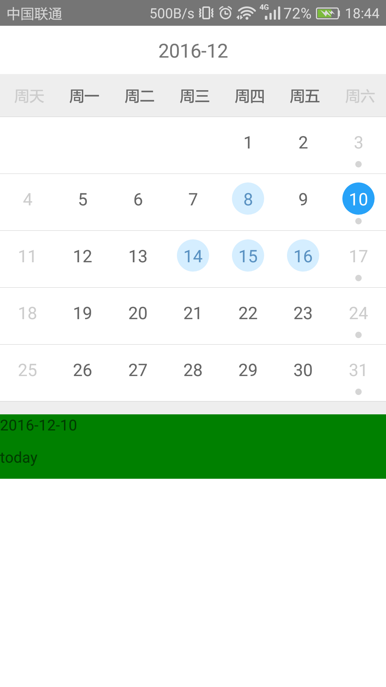

**使用如下：**

`<Calendar
             currentMonthData={this.state.data}
             onScroll={this._onScroll}
             onPick={this._selectDate}
         />`

 

  <ul>
    <li>currentMonthData:初始化请求数据</li>  
    <li>onScroll:滚动时回调事件</li>
    <li>onPick：获取选中日期</li>
  </ul>
  
  

 效果图：
   